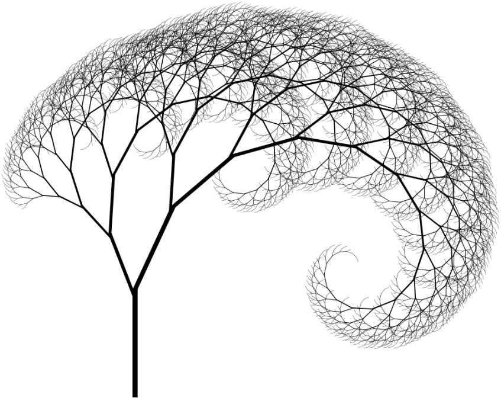

# Rappels cours 1

---

### Définition de variable
```scala
val s1 = "Ma variable immutable"
```

### Définition de fonction
```scala
val plus2: Int => Int = x => x + 2
```

### Définition de méthode
```scala
def plus2(x: Int): Int = x + 2
```
---

### Génericité

```scala
def identity[A](a: A) = a
def combine[A](l: List[A], combine: A => A => A)
```

---

### Définition de classes
```scala
class Vehicule(val name: String)
```

### Définition de case classes
```scala
case class Vehicule(name: String)
```

### Définition d'objects
```scala
object Math {
  def pow(base: Double, exp: Double) = ???
}
```

### Définition de traits
```scala
trait Wheels {
  val wheelsCount: Int
}
```

---

### Pattern matching

```scala
Option(4) match {
  case Some(7) => "seven"
  case None => "empty"
  case _ => "other"
}
```

---

# Cours 2: La programmation fonctionnelle

---

## Un paradigme de programmation

Une approche/façon de programmer

- La programmation orienté objet
- La programmation impérative
- La programmation fonctionelle

---

## Concepts du paradigme

- Immuabilité
- Récursion
- Fonctions (first-class, d'ordre supérieur)
- Transparence référentielle 

---

## Immuabilité

La déclaration de variables est définitive, on peut apparenter cela à une équation mathématique
```scala
val n = 5
```

Cela s'oppose à l'assignation/réasignation de la programmation impérative
```scala
var n = 5
n = 6
```

Le symbole **=** sert à la **déclaration**, oubliez l'assignation intrinsequement impérative.

--- 

## La récursivité



---

La récursivité est innévitable dans un contexte immuable. 

C'est une approche déclarative (fonctionelle) et s'oppose à l'itération (impérative).

Il existe de nombreux algorithmes et structures de données fondamentalement récursives
- fibonacci, factorielle, pgcd, quickSort, bfs, dfs ...
- arbres, graphes, structures composites ...

---

En programmation fonctionelle *tout* algorithme a plusieurs étapes est résolu par récursivité, l'itération n'est pas utilisée.


---

## La fonction

Penser à la *fonction mathématique* 

avec les propriétés suivantes:
- Totale
- Pure

**⚠** Ca n'est pas simplement une fonction au sens programmation! **⚠**

---

### La fonction totale

Une fonction est dite totale si elle admet, pour toute valeur du domaine un valeur du codomaine.

En math: ℤ => ℤ  -  En programmation: Int => Int

En math: ℤ => ℕ  -  En programmation: Int => ???

---

### La fonction totale

Une fonction totale
```scala
def max(a: Int, b: Int) = if (a >= b) a else b
```

Une fonction partielle (terminaison du programme)
```scala
def partial(unit: String): Int = 
  if (unit == "kilo") 1000
  else if (unit == "mega") 1000000
  else throw new IllegalArgumentException("Unknown unit")
```

Une fonction partielle (non terminaison)
```scala
def fib(n: Int): Int = 
  if (n == 1 || n == 2) 1 
  else fib(n-1) + fib(n-2)
```

Le type d'une terminaison (exception) ou d'une non-terminsaison (boucle infinie) est décrite par le type **Nothing** (bottom element).

---

### Fonctions partielles connues

```scala
myList.head
myList.reduce(_ + _)
myCollection.get(5)
myString.indexOf()
Math.sqrt
Math.div
```

---

### Fonctions totales et types primitifs

Contrairement aux mathematiques il n'est pas possible de directement restreindre le domaine d'une fonction.

Les briques de bases en programmation sont les types primitifs (Int, Boolean).

---


Exemple: 
- En math: Pour tout **n >= 1**, Fib(n) = Fib(n-1) + Fib(n-2)
- En Scala
```scala
def fib(n: ???) = fib(n-1) + fib(n-2)
```

---

### Rendre une fonction partielle totale

Une fonction partielle appelée avec une valeur en dehors de son domaine termine en erreur. Il n'est donc pas souhaitable de les utiliser.

Il existe quelques techniques pour "compléter" les fonctions partielles.

---

#### Modification du codomaine

Au lieu de restreindre le domaine, on étend le codomaine.

```scala
def fib(n: Int): Option[Int] = ???
```

La solution n'est pas idéale
- La fonction fib a plusieurs responsabilités (gestion des valeurs invalides + calcul de la suite de fibonacci)
- L'appel *valide* fib(8) retourne Some(13) et non 13

---

#### Modification du domaine ?

Refinement types: un type primitif + un prédicat
- PositiveInteger: *i & (i: Int, i > 0)* 
- EvenNumber: *i & (i: Int, i % 2 == 0)* 
```scala
def fib(n: PositiveInteger): Int = ???
```

- La définition de types "affinés" n'est pas supportée nativement par Scala mais possible au travers de *Refined*
- C'est une feature présente plutôt dans des langages "académiques" (LiquidHaskell)

---

### La fonction pure
```scala
def add(a: Int, b: Int) = a + b
```

La fonction impure non déterministe (utilisation d'un état)
```scala
def add(a: Int, b: Int) = a + b + globalVar
```

La fonction impure (effet de bord)
```scala
def add(a: Int, b: Int) = {
  writeFile("log.txt")
  a + b
}
```

---

#### Définition effet de bord
Une fonction est dite à effet de bord si elle a une interaction **observable** avec le monde exterieur autre que sa valeur de retour.

---

### Fonction d'ordre supérieur

Une fonction d'ordre supérieur est un fonction qui:
- prend une ou plusieurs fonctions en paramètre
- retourne une fonction

Ces fonctions sont abondantes et sont des "first-class citizen" dans la plupart des langages.

Pouvez-vous donner quelques exemples ?

---

#### Exemples de fonctions d'ordre supérieur

```scala
List("1", "foo").filter(isInt)
List(1, 2, 3).reduce((a, b) => a + b)
List(1, 2, 3).sortWith((a, b) => a > b)
```

---

## Curryfication

Une fonction est dit **currifiée** si elle prend un unique argument.

La **currification** est le processus par lequel un fonction à plusieurs arguements est traduite en une séquence de fonctions a un argument.

```scala
def add(a: Int, b: Int) = a + b
def add(a: Int)(b: Int) = a + b
val add: Int => Int => Int = a => b => a + b
```

---

## Application partielle

L'application partielle est le dual de la curryfication.

Appliquer partiellement une fonction currifiée
```scala
def add5 = add(5)
```

Appliquer partiellement une fonction non currifiée
```scala
def add5 = add(5, _)
```

Appliquer partiellement les paramètres non linéairement
```scala
def add5 = add(_, 5)
def add5 = add(_)(5)
```

---

## Transparence référentielle

La transparence référentielle est une propriété (d'un programme) qui permet de remplacer une expression par sa valeure.

Cette propriété est évidente en mathématique.
```
x = 2
x + x + 3 + y <=> 2 + 2 + 3 + y
```

---

La propriété est aussi valable dans un contexte fonctionnel
```scala
val x = 5
x + x + 3 + y <=> 2 + 2 + 3 + y
```

```scala
def square(n: Int) = n * n
val m = square(5) + square(5) <=> val m = 25 + 25
```

---

### Contre-exemples de transparence référentielle

```scala
def myFun() = {
  println("calling myFun")
  5
}
```

```scala
val x = myFun() + myFun()
```

n'est pas équivalent à

```scala
val y = myFun()
val x = y + y
```

---

## Expressions vs instructions

Les instructions sont des **commandes** et sont donc à proscrire (impératif)
```scala
if (cond)
    return "yes"
else
    return "no"
```

Les expressions décrivent une valeur
```scala
if (cond) "yes" else "no"
``` 

---

### Programmation déclarative et impérative

Impératif : Un calcul est réalisé un ensemble d'instructions qui mutent un état
```java
int sum(List<Integer> list) {
    int sum = 0;
    for (int i: list) {
        sum += i;
    }
    return sum;
}
```

Déclaratif : Un calcul est exprimé
```scala
def sum(l: List[Int]): Int = {
  case h :: t => h + sum(t)
  case Nil => 0
}
```

---

### Déclaratif/impératif en Scala

Essayez d'utiliser au maximum les expressions. 

En Scala la syntaxe est un bon indicateur pour distinguer l'approche déclarative de l'approche impérative

Un block de code (impératif, un block peut contenir une suite d'instructions)
```scala
def square(n: Int) = {
  println("calling square")
  n * n
}
```

--- 

### Déclaratif/impératif en Scala

Une expression (pas de bloc/d'accolades)
```scala
def square(n: Int) = n * n
```

Malheureusement il existe deux exception (la déclaration de variables, les fonctions partielles)

---

## Algebraic Data Types (ADT)

Les types de données algébriques servent à la modélisation de la donnée.
- Une approche objet modélise le domaine au travers d'objets (et de hierarchies d'objets)
- Une approche fonctionelle modélise le domaine au travers d'ADTs

Techniquement, un ADT est une union de produits.

---

Type union (Haskell)
```
data Bool = True | False
Bool peut prendre les valeurs True OU False
```

Type produit (Haskell)
```
data Coordinates = Cood Float Float
Le constructeur "Coord" peut pendre toutes les combinaison de Float ET Float
```

En scala (ADT par sous-typage)
```scala
sealed trait Tree
case object Empty extends Tree
case class Node(v: Int) extends Tree
case class Branch(left: Tree, right: Tree, v: Int) extends Tree
```

---

### Complexité des types

- Combien de *Nothing* ?

- Combien de *Unit* ?

- Combien de *Boolean* ?

- Combien de *Byte* ?

- Combien de *Int* ?

- Combien de *String* ?

---

### Complexité des types

- Combien de Nothing ? 0

- Combien de Unit ? 1

- Combien de Boolean ? 2

- Combien de Byte ? 256

- Combien de Int ? 2^32

- Combien de String ? ∞

---

### Complexité des types produits

- Combien de Boolean et Boolean ?

- Combien de Boolean et Byte ?

- Combien de Boolean et Unit ?

- Combien de Boolean et Nothing ?


---

### Complexité des types produits

- Combien de Boolean et Boolean ? 2 * 2 = 4

- Combien de Boolean et Byte ? 2 * 256 = 512

- Combien de Boolean et Unit ? 2 * 1 = 2

- Combien de Boolean et Nothing ? 2 * 0 = 0


---

### Complexité des types somme

- Combien de Boolean et Boolean ?

- Combien de Boolean et Byte ?

- Combien de Boolean et Unit ?

- Combien de Boolean et Nothing ?


---

### Complexité des types somme

- Combien de Boolean et Boolean ? 2 + 2 = 4

- Combien de Boolean et Byte ? 2 + 256 = 258

- Combien de Boolean et Unit ? 2 + 1 = 3

- Combien de Boolean et Nothing ? 2 + 0 = 2


---

### Complexité d'un ADT

- Combien de (Boolean et Unit) ou Byte ? (2 * 1) + 256 = 512

- Combien de (Boolean ou Unit) et Boolean ? (2 + 1) * 256 = 768

- Combien de Boolean et Byte et Nothing ? 2 * 256 * 0 = 0


---

### Encodage des types unions

Encodage par sous-typage
```scala
sealed trait Direction
case object West extends Direction
case object North extends Direction
case object East extends Direction
case object South extends Direction
```

```scala
val errorOrSuccess: Either[Error, Int] = readFile("file.txt")
```

---

### Encodage des types produits

```scala
case class Person(name: String, age: Int)

case class Color(red: Int, green: Int, blue: Int)

val pair: (Int, String) = (5, "Hello world !")
```

---

### Exemple d'ADTs

```scala
sealed trait Vehicle
case object Bicycle extends Vehicle 
case class Motorcycle(horsepower: Int) extends Vehicle
case class Car(doors: Int, weight: Int) extends Vehicle
```

---

### ADT Paramétriques

```scala
sealed trait Tree[+A]
case object Leaf extends Tree[Nothing]
case class Node[A](a: A, l: Tree[A], r: Tree[A]) extends Tree[A]
```

Nombreux dans la librairie standard.

---

## Generalized Algebraic Data Types (GADT)

Les GADTs sont une géneralization des ADT paramétrés.

Plus puissants et plus expressifs que les ADT "classiques".

Comment modéliser le DSL suivant ?
```scala
sealed trait Expr
case class IntVal(a: Int) extends Expr
case class StringVal(a: String) extends Expr
case class Add ???
case class Concat ???
```

---

Avec un GADT, chaque type produit peut instancier explicitement l'ADT.

```scala
sealed trait Expr[A]
case class IntVal(a: Int) extends Expr[Int]
case class StringVal(a: String) extends Expr[String]
case class Add(lhs: Expr[Int], rhs: Expr[Int]) extends Expr[Int]
case class Concat(lhs: Expr[String], rhs: Expr[String]) extends Expr[String]
```

---

## A retenir

- Functions mathématiques (*totales* et *pures*)
- Résourdre les calculs par une approche déclarative
- Des ADT pour la modélisation de données

- Ce méfier des features impératives de Scala
    - Pas de null
    - Pas de catching d'exceptions (dans du code pure)
    - Pas d'effets de bord (dans du code pure)
    - Pas de type casting (asInstanceOf)
    - Pas de equals, toString, hashCode
    
---